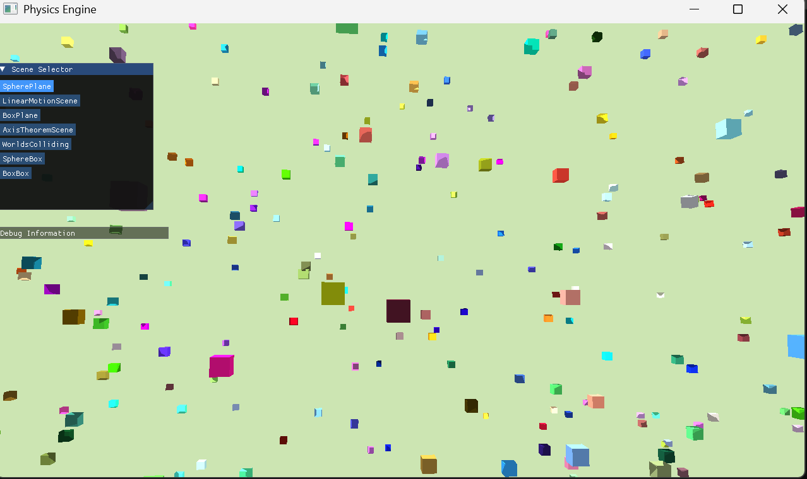
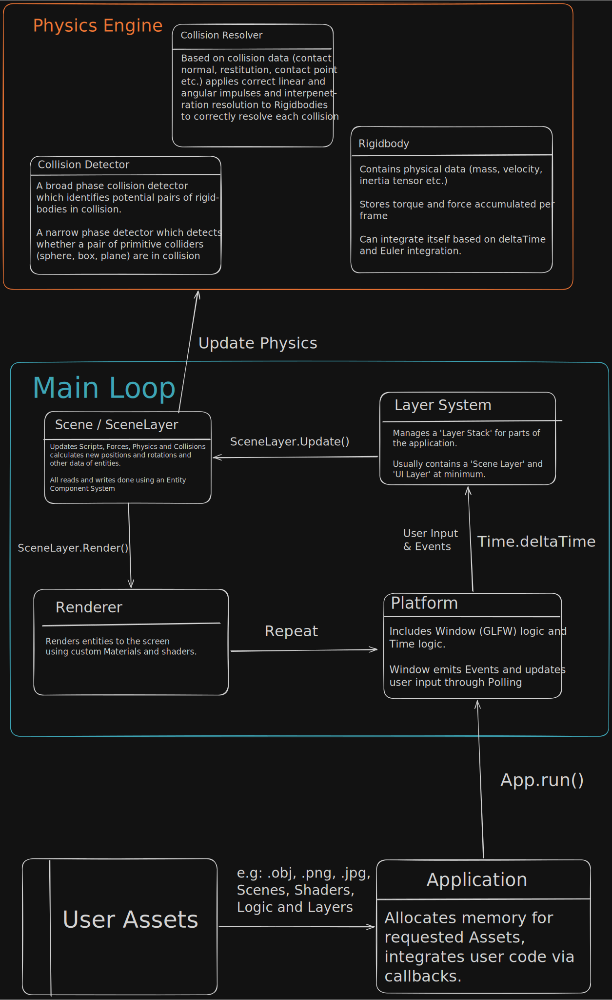
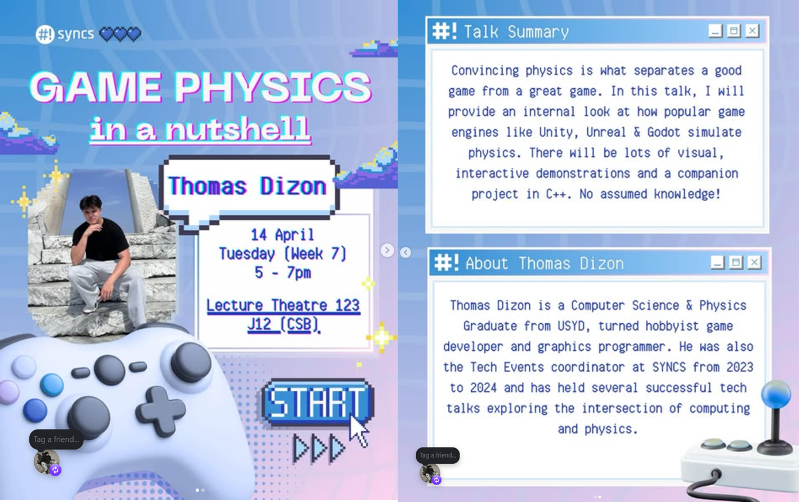

# 3D Rigidbody Physics Engine

## What is this?
- A **Rigidbody** is a way of modelling the translational and rotational motion of arbitrary 3D objects based on the assumption that it is 'rigid' (More like a rock, less like a sponge).
- A **Physics Engine** is a module of code that is responsible for calculating the motion of objects in a scene based on (semi) accurate physics and reporting that data to the part of code that updates the object's data and render's it to the screen.
- Thus, this project is an implementation of a system for simulating accurate physics in a 3D scene, and a clean API for a programmer to integrate it into some application. 

## Demo
- You can interact with a working demo of an Application which uses the project [here](https://tommiedevelops.github.io/rigidbody-physics-engine/).
<div align="center">
    
    <p><em>A screenshot of the 'Linear Motion Scene' demo in my example application which uses the Rigidbody Physics Engine. On the left is a small GUI rendered with ImGui for scene selection. A large number of colored cubes are rendered to the screen, moving in random directions</em></p>
</div>

## Features
- An OpenGL based 3D Renderer and Asset Manager complete with custom models, textures and shaders
- An Entity-Component System based on EnTT for efficient Scene reads and updates
- An Event System which uses the 'Event Handler/Dispatcher' pattern which interacts with GLFW directly
- An Layer system for the application for intuitive construction (based on TheCherno's Game Engine series)
- A Scriptable-Entity system for providing custom run-time behaviour for entities within a scene.
- An infant Collision Detection & Response system (still W.I.P)
- A rigidbody class which handles its own data updates and integration (implemened using the simple Euler method)
- Project can be compiled to Web Assembly via Emscripten


## System Design Diagram
- In this project, I use an App-Core architecture where Core contains stable, reusable logic and App changes depending on how the programmer wishes to use Core.
- Scene Data is organised using an Entity Component System which makes read and writes very efficient. The programmer can create custom Entities by added various Components. One special component is the ScriptComponent which allows the programmer to add custom logic to each entitiy.
- The Application itself is to be implemented using a Layering System where the programmer breaks the application down into various sections for example a UI Layer and a SceneLayer. Events are propagates top-down relative to the LayerStack.
- The Physics Engine cares about entites in the Scene that have the Rigidbody Component. It will take its rigidbody data as well as any forces acting on the rigidbody and perform an Euler Integration to report the object's new position and orientation based on the physics simulation.

<div align="center">
    
    <p><em>
    From bottom to top, the user starts by inputting any .obj 3D models, any .mtl files corresponing to those models, any texture files (.png/.jpg) for use in constructing Materials for Entities in the scene as well as any custom SetUp() logic or runtime ScriptableEntity logic. When the application is run, it enters the Main Loop which Polls of new events, and updates Time.deltaTime and updates each Layer in the LayerStack. When the SceneLayer is Updated, it updates the Physics System and afterward any entity data. Then, the objects are rendered to the screen and the loop repeats.
    </em></p>
</div>

## Dependencies
This project makes use of various open source libraries including 
- [OpenGL3](https://www.opengl.org/) for rendering
- [GLM](https://github.com/g-truc/glm) for math operations
- [EnTT](https://github.com/skypjack/entt) for an ECS implementation
- [TinyObj](https://github.com/tinyobjloader/tinyobjloader) for obj loading
- [CMake](https://cmake.org/) for building the project
- [Emscripten](https://emscripten.org/index.html) for building the project for web
- [GLFW](https://www.glfw.org/) for window management and events / input
- [Glad](https://github.com/dav1dde/glad) for dynamic retrieval of OpenGL functions
- [ImGui](https://github.com/ocornut/imgui) for the Gui's you see on the screen

## Installation Instructions
- I don't reccomend installing the project or building it as I haven't cleaned it up yet but if you really want to,
- Make sure you have installed all of the above dependencies.
- Git clone this project
- run this command: ```cmake -B app``` in the project's root 
- then this: ``` cmake --build app ``` and pray that it builds. If not, I leave troubleshooting up to you (for now)
- If all goes well, you should have a .exe you can run and play with.
- To build for web, you need to have emscripten installed.
- Then run ```emcmake --build app``` and it should create a .wasm, .js and .html file you can play around with to make it work on web.

## Limitations
- This is very much a WORK IN PROGRESS. There is a lot I still don't understand. I'm taking a break from this to improve my Linear Algebra, Classical Mechanics and Web Development. Then I will return to make this project a lot better.
- It is missing a good Collision Detection and Response system. There is one that exists but it's not very good.
- The code base needs a good clean up and refactor to make the API cleaner and code smoother.
- This is my very first C++ and OpenGL project so it is far from optimal
- I still need to implement Friction, Resting Contacts, Broad Phase collision detection and probably a lot more. 
- The web page is the default emscripten page so it's not ideal.
- I haven't created very nice demo scenes to show off it's capabilites yet
- There's no meaningful debug information yet
- There's probably pollution in the project from my Visual Studio work and CMake building. If so, very sorry in advance.

## Learning Resources
- The project is heavily inspired by the text **Ian Millington's Game Physics Engine Development** and [TheCherno](https://www.youtube.com/@TheCherno)'s YouTube series on game engines.
- It's also my first time programming in C++ and OpenGL which I learned at [learncpp.com](learncpp.com) and [learnopengl.com](learnopengl.com) respectively!

## I did a talk on it

- Probably worth mentioning that I did a talk on this despite its limited state. Unfortunately no recording is available but here is an excerpt of the advertising material
